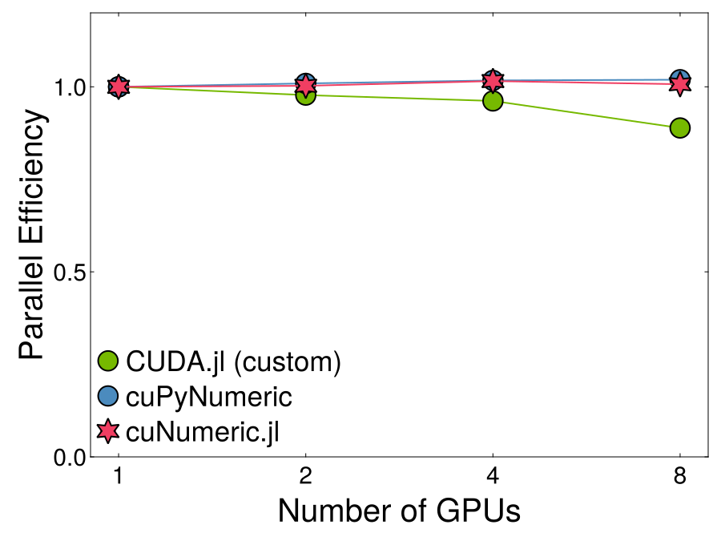

# Benchmarking cuNumeric.jl Programs

Since there is no programatic way to set the hardware configuration (as of 24.11) benchmarking cuNumeric.jl code is a bit tedious. As an introduction, we walk through a benchmark of matrix multiplication (SGEMM). All the code for this benchmark can be found in the `cuNumeric.jl/pkg/benchmark` directory.

> [!WARNING]  
> We do not commit to maintaining the benchmark scripts, due to difficulty programatically configuring legate and API overturn as we work on cuNumeric v1.0. The general principles used should work, even if the code does not.


## Weak Scaling of SGEMM

In this benchmark we will try to understand the weak scaling behavior of the SGEMM kernel (Float32 MatMul). To get started we need to decide our initial problem size, `N` and create some arrays. Note depending on the choice of `N`, Legate may decide to schedule your tasks on the CPU or GPU or both. We will also define two functions, `total_flops` and `total_space` which will help us calculate some useful benchmark metrics.

```julia
using cuNumeric

function initialize_cunumeric(N, M)
    A = cuNumeric.as_type(cuNumeric.rand(NDArray, N, M), Float32)
    B = cuNumeric.as_type(cuNumeric.rand(NDArray, M, N), Float32)
    C = cuNumeric.zeros(Float32, N, N)
    GC.gc() # remove the intermediate FP64 arrays
    return A, B, C
end

function total_flops(N, M)
    return N * N * ((2*M) - 1)
end

function total_space(N, M)
    return 2 * (N*M) * sizeof(Float32) + (N*N) * sizeof(Float32)
end
```

We cannot use rely on common benchmark tools in Julia like [BenchmarkTools.jl](https://github.com/JuliaCI/BenchmarkTools.jl) or [ChairMarks.jl](https://github.com/LilithHafner/Chairmarks.jl) or even the built in `Base.@time` macro. The asynchronous nature of operations on NDArrays means that function calls will execute almost immediately and program execution must be blocked to properly time a kernel. It is technically possible to time NDArray operations with something like [BenchmarkTools.jl](https://github.com/JuliaCI/BenchmarkTools.jl) by adding a blocking operation (e.g., accessing the result), but the allocations reported by these tools will never be correct and it is safer to use the timing functionality from CuPyNumeric. 

The timer built into CuPyNumeric blocks execution until all Legate operations preceding the call that generated the timing object complete. We provide two timing utilities: `get_time_microseconds` and `get_time_nanoseconds`. 

Now we can write the benchmark code. There are two more parameters we need to set: the number of samples, `n_samples`, and the number of warm-up samples, `n_warnup`. With all this the benchmark loop is:

```julia
using LinearAlgebra 
using cuNumeric

function gemm_cunumeric(N, M, n_samples, n_warmup)
    A, B, C = initialize_cunumeric(N, M)

    start_time = nothing
    for idx in range(1, n_samples + n_warmup)
        if idx == n_warmup + 1
            start_time = get_time_microseconds()
        end

        mul!(C, A, B)
    end
    total_time_μs = get_time_microseconds() - start_time
    mean_time_ms = total_time_μs / (n_samples * 1e3)
    gflops = total_flops(N, M) / (mean_time_ms * 1e6) # GFLOP is 1e9

    return mean_time_ms, gflops
end

n_samples = 10
n_warmup = 2

mean_time_ms, gflops = gemm_cunumeric(N, n_samples, n_warmup)
```

Since there is no programatic way to set the hardware configuration we must manipulate the environment variables described in [Setting Hardware Configuration](@ref) through shell scripts to make a weak scaling plot. These variables must be set before we launch the Julia runtime where we will run our benchmark. Therefore, I do not recommend generating scaling plots from the REPL because you would have to start and stop the REPL each time to re-configure the hardware settings. To make benchmarking easier, we provide a small shell script, `run_benchmark.sh`, located in `cuNumeric.jl/pkg/benchmark`. This script will automatically set the `LEGATE_CONFIG` according to the passed flags and run the specified benchmark file.

The first time using this script it is important to set the memory configuration which is currently hard coded in `run_benchmark.sh` where `LEGATE_CONFIG` is exported. We recommend using the memory configuration which is automatically chosen by Legate. It is also important to note that `run_benchmark.sh` assumes the environment containing cuNumeric.jl is at the relative path `..` as hardcoded in the variable `CMD` (this is correct if you did not move files around). If your cuNumeric.jl environment is different be sure to update the path in `run_benchmark.sh`.

We have placed the SGEMM example from above into a Julia file called `sgemm.jl` located in the `cuNumeric.jl/pkg/benchmark` directory. We also added basic argument parsing to get settings from the command line so that we do not have to open the file to edit the settings each time.
```julia
gpus = parse(Int, ARGS[1])
N = parse(Int, ARGS[2])
M = parse(Int, ARGS[3])
n_samples = parse(Int, ARGS[4])
n_warmup = parse(Int, ARGS[5])
```

To run the benchmark simply run the following command with your settings. Be sure to update the legate config in this file as described above!
```sh
./run_benchmark.sh sgemm.jl --cpus <n-cpus> --gpus <n-gpus> <N> <M> <n_samples> <n_warmup>
```

Successful completion of one run should look like:

```bash
./run_benchmark.sh sgemm.jl --cpus 1 --gpus 1 10000 10 2
Running sgemm.jl with 1 CPUs and 1 GPUs
Running: julia --project='..' sgemm.jl 10000 10 2
[ Info: Starting Legate
Legate hardware configuration: --cpus=1 --gpus=1 --omps=1 --ompthreads=3 --utility=2 --sysmem=256 --numamem=19029 --fbmem=7569 --zcmem=128 --regmem=0
[ Info: Started Legate successfully
[ Info: Running MATMUL benchmark on 10000x10000 matricies for 10 iterations, 2 warmups
cuNumeric Mean Run Time: 310.1302 ms
cuNumeric FLOPS: 6448.581918175012 GFLOPS
[ Info: Cleaning Up Legate
```

To generate a weak scaling plot, you must increment the problem size in proportion to the number of GPUs. This helps reveal any communication overhead in our SGEMM implementation since data may be transfered between GPUs or even across nodes in a server.


As part of a more [complete benchmark](@ref "Benchmark Results") we ran our code on up to 8 A100 GPUs (single-node) and compared it to the Python library cuPyNumeric as well as a custom implementation using CUDA.jl. From these resutls we can see that cuNumeric.jl is capable of scaling and saturating the GPU memory bandwidth for matrix multiplication.


GEMM Efficiency            |  GEMM GFLOPS
:-------------------------:|:-------------------------:
  |  

