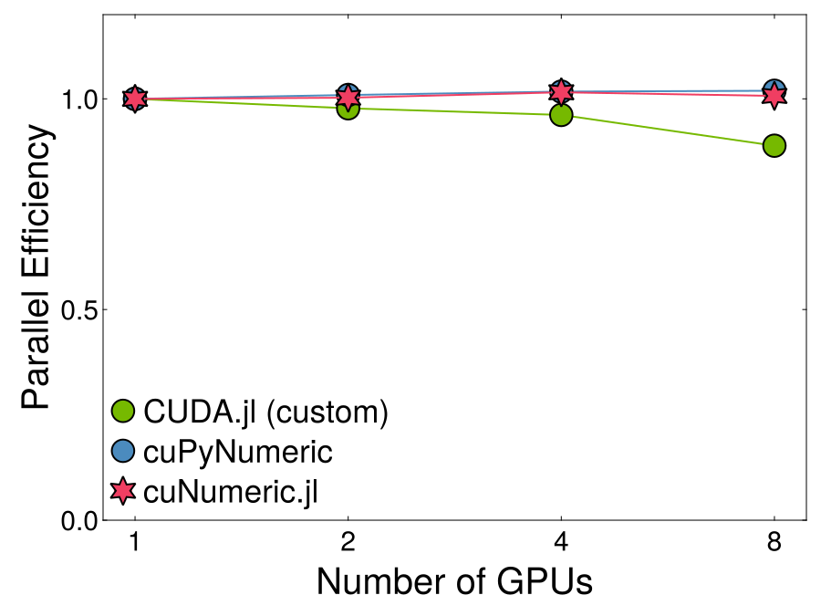
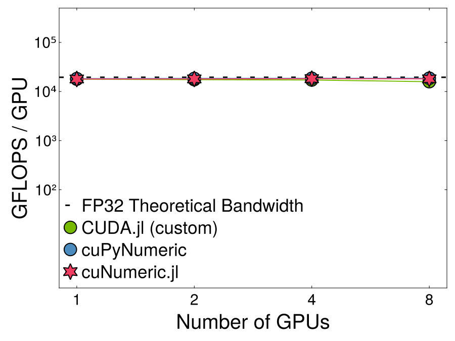
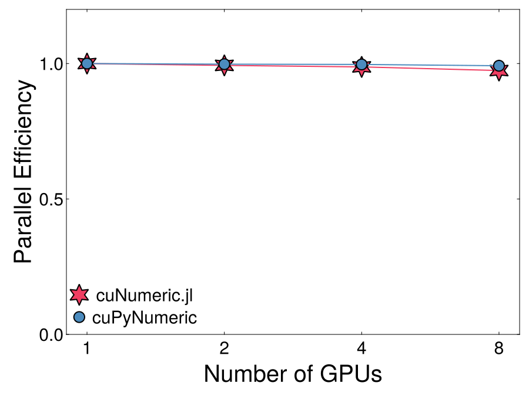
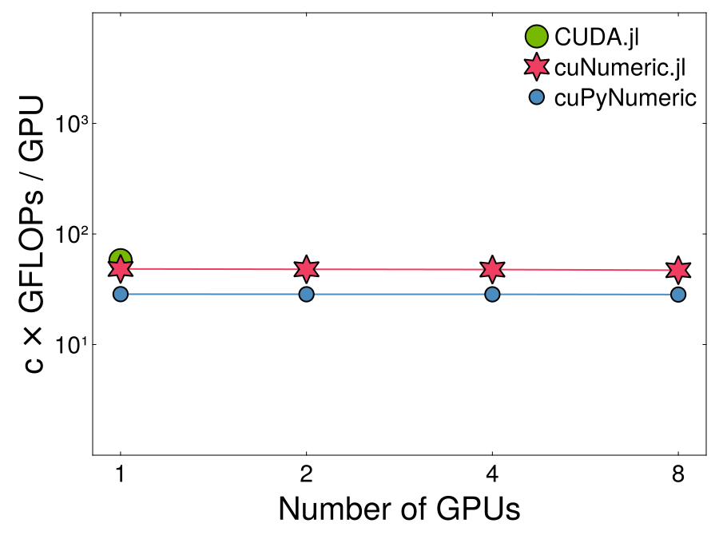
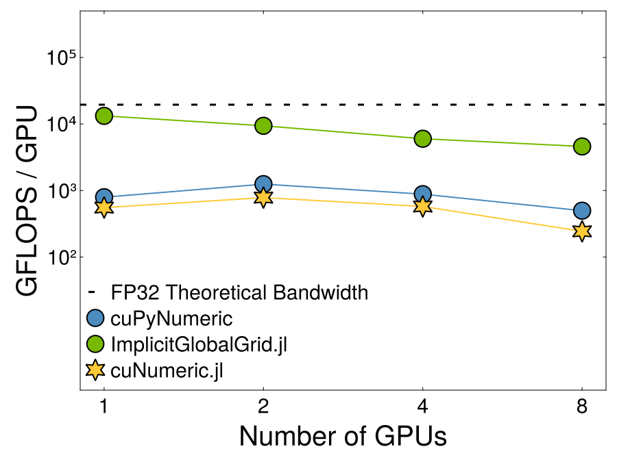

# Benchmark Results

For JuliaCon2025 we benchmarks cuNumeric.jl on 8 A100 GPUs (single-node) and compared it to the Python library cuPyNumeric and other relevant benchmarks depending on the problem. All results shown are weak scaling. We hope to have multi-node benchmarks soon!


```@contents
Pages = ["benchmark_results.md"]
Depth = 2:2
```

## SGEMM

Code Outline:
```julia
mul!(C, A, B)
```

GEMM Efficiency            |  GEMM GFLOPS
:-------------------------:|:-------------------------:
  |  

## Monte-Carlo Integration

Monte-Carlo integration is embaressingly parallel and should scale perfectly. We do not know the exact number of operations in `exp` so the GFLOPs is off by a constant factor. 

Code Outline:
```julia
integrand = (x) -> exp(-square(x))
val = (V/N) * sum(integrand(x))
```

MC Efficiency            |  MC GFLOPS
:-------------------------:|:-------------------------:
  |  


## Gray-Scott (2D)

Solving a PDE requires halo-exchanges and lots of data movement. In this benchmark we fall an order of magnitude short of the `ImplicitGlobalGrid.jl` library which specifically targets multi-node, multi-GPU halo exchanges. We attribute this to the lack of kernel fusion in cuNumeric.jl

