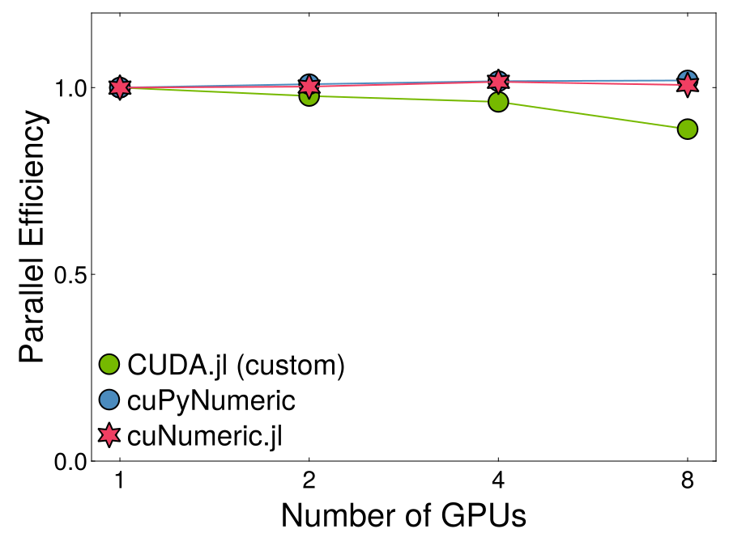
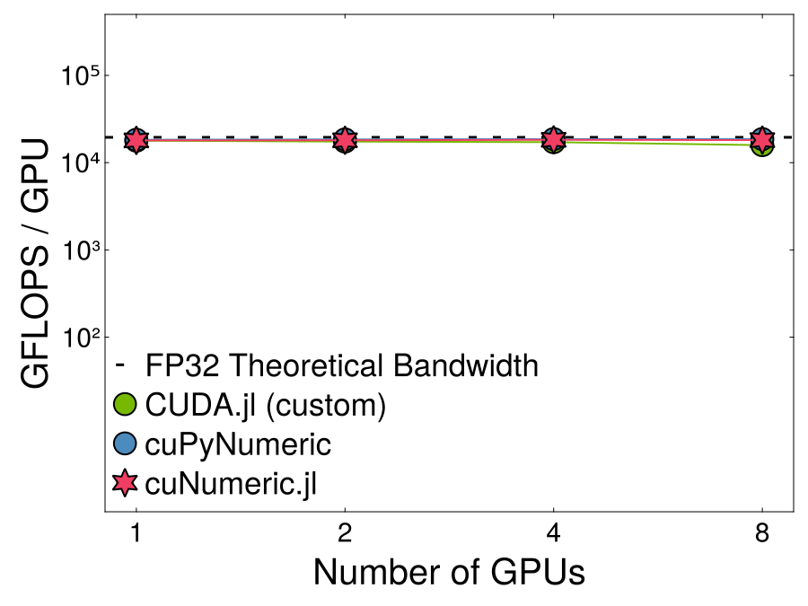
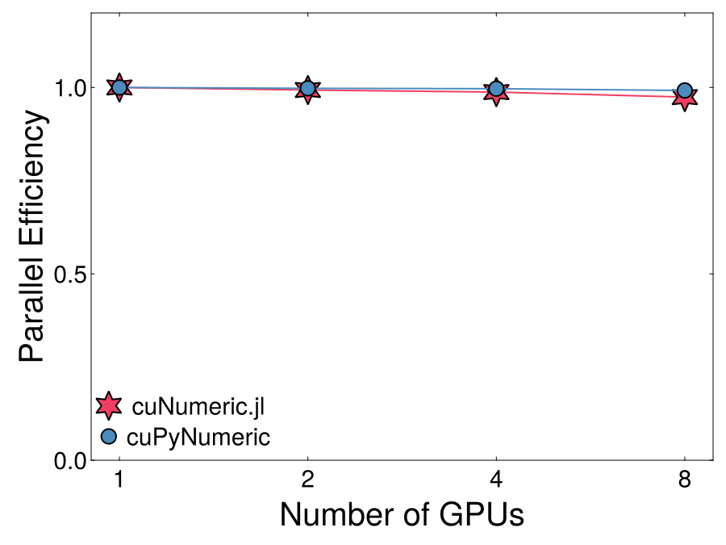
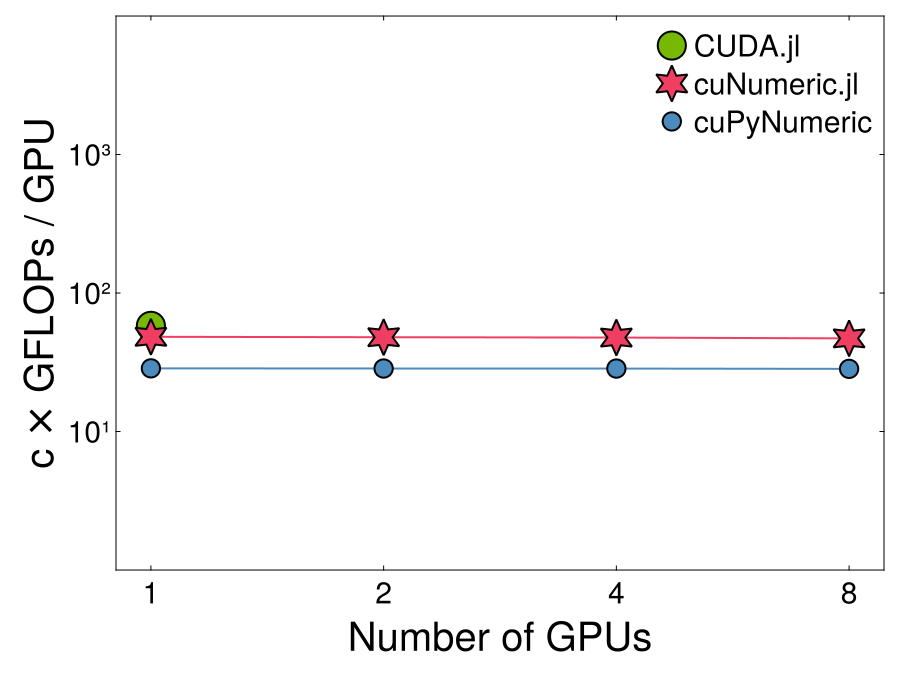
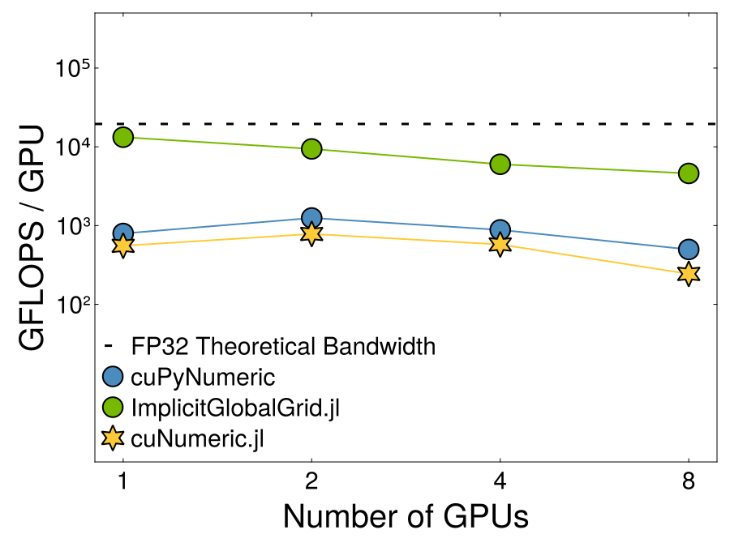

# Benchmark Results

These historical JuliaCon 2025 results compare cuNumeric.jl with cuPyNumeric and problem-specific alternatives on one node with eight A100 GPUs. All plots show weak scaling. See [How to Benchmark](./howto.md) for the current harness and its baseline, `@accelerate`, fused, and unfused variants.

## SGEMM

Code Outline:
```julia
mul!(C, A, B)
```

```@raw html
<table>
  <tr>
    <th>GEMM Efficiency</th>
    <th>GEMM GFLOPS</th>
  </tr>
  <tr>
    <td></td>
    <td></td>
  </tr>
</table>
```

## Monte-Carlo Integration

Monte-Carlo integration is embarrassingly parallel. Because the exact operation count of `exp` is implementation-dependent, the plotted operation rate is scaled by an approximate constant.

Code Outline:
```julia
integrand = (x) -> exp.(-x.^2)
val = (V/N) * sum(integrand(x))
```

```@raw html
<table>
  <tr>
    <th>MC Efficiency</th>
    <th>MC GFLOPS</th>
  </tr>
  <tr>
    <td></td>
    <td></td>
  </tr>
</table>
```

## Gray-Scott (2D)

Solving a PDE requires halo exchanges and lots of data movement. In this benchmark we fall an order of magnitude short of the `ImplicitGlobalGrid.jl` library which specifically targets multi-node, multi-GPU halo exchanges. Broadcast fusion helps on the elementwise update, but communication and stencil data movement still dominate the gap.

```@raw html
<table>
  <tr>
    <th>GS GFLOPS</th>
  </tr>
  <tr>
    <td></td>
  </tr>
</table>
```
