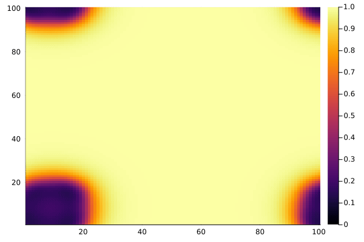

# Examples


## DAXPY
```julia
# found in examples/daxpy.jl
using cuNumeric

arr = cuNumeric.rand(NDArray, 20)

α = 1.32
b = 2.0

arr2 = α*arr + b

arr2[:] # disp array
```
## Monte-Carlo Integration

Most integrals can be estimated with a basic Monte-Carlo estimator:

```math
\hat{I}_N = \frac{\Omega}{N}\sum_{i=1}^Nf(x_i)
```
where `N` is the number of samples, ``\Omega`` is the volume of the domain and ``x_i`` are sampled indpendently and uniformly at random from the domain. This estimator is guranteed to converge (subject to some minor constraints) at a rate independent of the dimension and is embaressingly parallel to compute!

In the example below, we estimate the integral:
```math
I = \int_{-\infty}^{\infty}e^{-x^2}.
```

Since we cannot uniformly sample form negative to positive infinity, we truncate the domain between -5 and 5. This is ok since the integrand exponentially decays and we won't be off by much in the end.
```julia
# found in examples/integrate.jl
using cuNumeric

integrand = (x) -> exp(-square(x))

N = 1_000_000

x_max = 5.0
domain = [-x_max, x_max]
Ω = domain[2] - domain[1]

samples = Ω*cuNumeric.rand(NDArray, N) - x_max 
estimate = (Ω/N) * sum(integrand(samples))

println("Monte-Carlo Estimate: $(estimate[1])")
println("Analytical: $(sqrt(pi))")
```
## Gray Scott Reaction Diffusion
```julia
# found in examples/gray-scott.jl
using cuNumeric
using Plots

struct Params
    dx::Float64
    dt::Float64
    c_u::Float64
    c_v::Float64
    f::Float64
    k::Float64

    function Params(dx=1, c_u=1.0, c_v=0.3, f=0.03, k=0.06)
        new(dx, dx/5, c_u, c_v, f, k)
    end
end

function step(u, v, u_new, v_new, args::Params)
    # calculate F_u and F_v functions
    # currently we don't have NDArray^x working yet. 
    F_u = ((-u[2:end-1, 2:end-1].*(v[2:end-1, 2:end-1] .* v[2:end-1, 2:end-1])) +
            args.f*(1 .- u[2:end-1, 2:end-1]))
    F_v = ((u[2:end-1, 2:end-1].*(v[2:end-1, 2:end-1] .* v[2:end-1, 2:end-1])) -
            (args.f+args.k)*v[2:end-1, 2:end-1])
    # 2-D Laplacian of f using array slicing, excluding boundaries
    # For an N x N array f, f_lap is the Nend x Nend array in the "middle"
    u_lap = ((u[3:end, 2:end-1] - 2*u[2:end-1, 2:end-1] + u[1:end-2, 2:end-1]) ./ args.dx^2 
           + (u[2:end-1, 3:end] - 2*u[2:end-1, 2:end-1] + u[2:end-1, 1:end-2]) ./ args.dx^2)
    v_lap = ((v[3:end, 2:end-1] - 2*v[2:end-1, 2:end-1] + v[1:end-2, 2:end-1]) ./ args.dx^2 
           + (v[2:end-1, 3:end] - 2*v[2:end-1, 2:end-1] + v[2:end-1, 1:end-2]) ./ args.dx^2)

    # Forward-Euler time step for all points except the boundaries
    u_new[2:end-1, 2:end-1] = ((args.c_u * u_lap) + F_u) * args.dt + u[2:end-1, 2:end-1]
    v_new[2:end-1, 2:end-1] = ((args.c_v * v_lap) + F_v) * args.dt + v[2:end-1, 2:end-1]

    # Apply periodic boundary conditions
    u_new[:,1] = u[:,end-1]
    u_new[:,end] = u[:,2]
    u_new[1,:] = u[end-1,:]
    u_new[end,:] = u[2,:]
    v_new[:,1] = v[:,end-1]
    v_new[:,end] = v[:,2]
    v_new[1,:] = v[end-1,:]
    v_new[end,:] = v[2,:]
end

function gray_scott()
    anim = Animation()

    N = 100
    dims = (N, N)

    FT = Float64
    args = Params()

    n_steps = 2000 # number of steps to take
    frame_interval = 200 # steps to take between making plots

    u = cuNumeric.ones(dims)
    v = cuNumeric.zeros(dims)
    u_new = cuNumeric.zeros(dims)
    v_new = cuNumeric.zeros(dims)

    u[1:15,1:15] = cuNumeric.random(FT, (15,15))
    v[1:15,1:15] = cuNumeric.random(FT, (15,15))

    for n in 1:n_steps
        step(u, v, u_new, v_new, args)
        # update u and v 
        # this doesn't copy, this switching references 
        u, u_new = u_new, u
        v, v_new = v_new, v

        if n%frame_interval == 0
            u_cpu = u[:, :]
            heatmap(u_cpu, clims=(0, 1))
            frame(anim)
        end
    end
    gif(anim, "gray-scott.gif", fps=10)

end

gray_scott()
```

