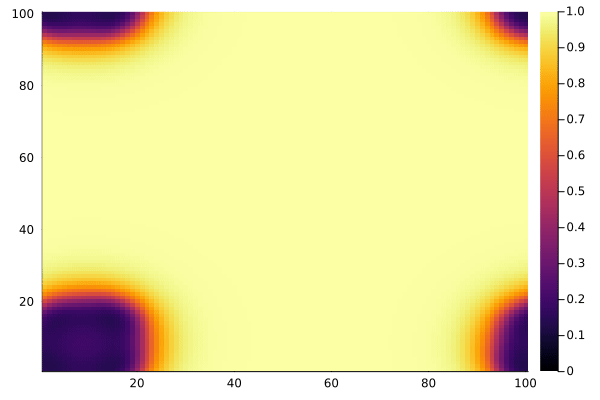

# Gray-Scott Reaction Diffusion

```julia
# found in examples/gray-scott.jl
using cuNumeric
using Plots

# Flattened u snapshots land here for examples/dmd.jl to analyze.
const SNAPSHOT_FILE = "gray-scott.h5"

struct Params{T}
    dx::T
    dt::T
    c_u::T
    c_v::T
    f::T
    k::T

    function Params(dx=1.0f0, c_u=1.0f0, c_v=0.3f0, f=0.03f0, k=0.06f0)
        new{Float32}(dx, dx/5, c_u, c_v, f, k)
    end
end

function bc!(u_new, v_new, u, v)
    u_new[:,1] = u[:,end-1]
    u_new[:,end] = u[:,2]
    u_new[1,:] = u[end-1,:]
    u_new[end,:] = u[2,:]
    v_new[:,1] = v[:,end-1]
    v_new[:,end] = v[:,2]
    v_new[1,:] = v[end-1,:]
    v_new[end,:] = v[2,:]
end

function step!(u, v, u_new, v_new, args::Params)
    @analyze_lifetimes begin
        # Prefer @. so every op is dotted and the tree can fuse
        F_u = @. -u[2:end-1, 2:end-1] * (v[2:end-1, 2:end-1]^2) +
            args.f * (1.0f0 - u[2:end-1, 2:end-1])
        F_v = @. u[2:end-1, 2:end-1] * (v[2:end-1, 2:end-1]^2) -
            (args.f + args.k) * v[2:end-1, 2:end-1]

        u_lap = @. (
            (u[3:end, 2:end-1] - 2 * u[2:end-1, 2:end-1] + u[1:end-2, 2:end-1]) / args.dx^2 +
            (u[2:end-1, 3:end] - 2 * u[2:end-1, 2:end-1] + u[2:end-1, 1:end-2]) / args.dx^2
        )
        v_lap = @. (
            (v[3:end, 2:end-1] - 2 * v[2:end-1, 2:end-1] + v[1:end-2, 2:end-1]) / args.dx^2 +
            (v[2:end-1, 3:end] - 2 * v[2:end-1, 2:end-1] + v[2:end-1, 1:end-2]) / args.dx^2
        )

        u_new[2:end-1, 2:end-1] = @. (args.c_u * u_lap + F_u) * args.dt + u[2:end-1, 2:end-1]
        v_new[2:end-1, 2:end-1] = @. (args.c_v * v_lap + F_v) * args.dt + v[2:end-1, 2:end-1]
    end

    bc!(u_new, v_new, u, v)
end

function gray_scott()
    #anim = Animation()

    N = 100
    dims = (N, N)

    args = Params()

    n_steps = 2000 # number of steps to take
    frame_interval = 200 # steps to take between making plots
    snapshot_interval = 20 # steps to take between saved snapshots

    u = cuNumeric.ones(dims)
    v = cuNumeric.zeros(dims)
    u_new = cuNumeric.zeros(dims)
    v_new = cuNumeric.zeros(dims)

    # One flattened frame per column, the layout DMD wants.
    snapshots = cuNumeric.zeros(Float32, N * N, n_steps ÷ snapshot_interval)

    u[1:15,1:15] = cuNumeric.rand(15,15)
    v[1:15,1:15] = cuNumeric.rand(15,15)

    for n in 1:n_steps
        step!(u, v, u_new, v_new, args)
        # update u and v
        # this doesn't copy, this switching references
        u, u_new = u_new, u
        v, v_new = v_new, v

        if n%snapshot_interval == 0
            snapshots[:, n ÷ snapshot_interval] = cuNumeric.reshape(u, (N * N, 1))
        end

        if n%frame_interval == 0
            u_cpu = u[:, :]
            heatmap(u_cpu, clims=(0, 1))
            frame(anim)
        end
    end
    gif(anim, "gray-scott.gif", fps=10)

    cuNumeric.h5write(SNAPSHOT_FILE, "u", snapshots)
    # h5write is asynchronous, so flush before another process opens the file.
    cuNumeric.Legate.runtime_sync()

    return u, v

end

u, v = gray_scott()
```


The snapshots written to `gray-scott.h5` are the input to
[Dynamic Mode Decomposition](./dmd.md).
